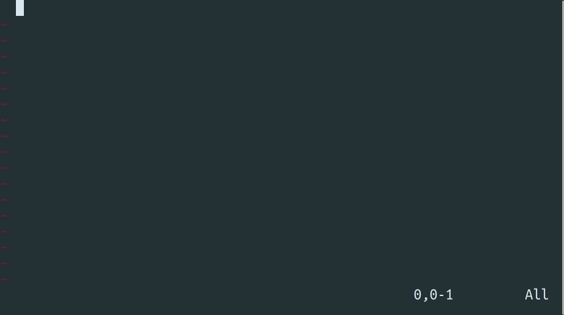

# vim-ai

This plugin adds Artificial Intelligence (AI) capabilities to your Vim and Neovim.
You can generate code, edit text, or have an interactive conversation with GPT models, all powered by OpenAI's API.



To get an idea what is possible to do with AI commands see the [prompts](https://github.com/madox2/vim-ai/wiki/AI-prompts#prompts) on the [Community Wiki](https://github.com/madox2/vim-ai/wiki)

## Features

- Generate text or code, answer questions with AI
- Edit selected text in-place with AI
- Interactive conversation with ChatGPT
- Supports custom roles and more

## How it works

This plugin uses OpenAI's API to generate responses.
You will need to [setup](https://platform.openai.com/signup) an account and obtain an [API key](https://platform.openai.com/account/api-keys).
Usage of the API is not free, but the cost is reasonable and depends on how many tokens you use, in simple terms, how much text you send and receive (see [pricing](https://openai.com/pricing)).
Note that the plugin does not send any of your code behind the scenes.
You only share and pay for what you specifically select, for prompts and chat content.

## Installation

### Prerequisites

- Vim or Neovim compiled with python3 support
- [API key](https://platform.openai.com/account/api-keys)

```sh
# save api key to `~/.config/openai.token` file
echo "YOUR_OPENAI_API_KEY" > ~/.config/openai.token

# alternatively set it as an environment variable
export OPENAI_API_KEY="YOUR_OPENAI_API_KEY"

# or configure it with your organization id
echo "YOUR_OPENAI_API_KEY,YOUR_OPENAI_ORG_ID" > ~/.config/openai.token
export OPENAI_API_KEY="YOUR_OPENAI_API_KEY,YOUR_OPENAI_ORG_ID"
```

The default api key file location is `~/.config/openai.token`, but you can change it by setting the `g:vim_ai_token_file_path` in your `.vimrc` file:

```vim
let g:vim_ai_token_file_path = '~/.config/openai.token'
```

### Using `vim-plug`

```vim
Plug 'madox2/vim-ai'
```

### Manual installation

Using built-in Vim packages `:help packages`

```sh
# vim
mkdir -p ~/.vim/pack/plugins/start
git clone https://github.com/madox2/vim-ai.git ~/.vim/pack/plugins/start/vim-ai

# neovim
mkdir -p ~/.local/share/nvim/site/pack/plugins/start
git clone https://github.com/madox2/vim-ai.git ~/.local/share/nvim/site/pack/plugins/start/vim-ai
```

## Usage

To use an AI command, type the command followed by an instruction prompt. You can also combine it with a visual selection. Here is a brief overview of available commands:

```
========= Basic AI commands =========

:AI         complete text
:AIEdit     edit text
:AIChat     continue or open new chat

============= Utilities =============

:AIRedo     repeat last AI command
:AINewChat  open new chat

:help vim-ai
```

**Tip:** Press `Ctrl-c` anytime to cancel completion

**Tip:** Setup your own [key bindings](#key-bindings) or use command shortcuts - `:AIE`, `:AIC`, `:AIR`

**Tip:** A [custom role](#roles) {role} can be passed to the above commands by an initial parameter /{role}, for example `:AIEdit /grammar`.

**Tip:** Combine commands with a range `:help range`, for example to select the whole buffer - `:%AIE fix grammar`

If you are interested in more tips or would like to level up your Vim with more commands like [`:GitCommitMessage`](https://github.com/madox2/vim-ai/wiki/Custom-commands#suggest-a-git-commit-message) - suggesting a git commit message, visit the [Community Wiki](https://github.com/madox2/vim-ai/wiki).

## Reference

In the documentation below,  `<selection>` denotes a visual selection or any other range, `{instruction}` an instruction prompt, `{role}` a [custom role](#roles) and `?` symbol an optional parameter.

### `:AI`

`:AI` - complete the text on the current line

`:AI {prompt}` - complete the prompt

`<selection> :AI` - complete the selection

`<selection> :AI {instruction}` - complete the selection using the instruction

`<selection>? :AI /{role} {instruction}?` - use role to complete

### `:AIEdit`

`<selection>? :AIEdit` - edit the current line or the selection

`<selection>? :AIEdit {instruction}` - edit the current line or the selection using the instruction

`<selection>? :AIEdit /{role} {instruction}?` - use role to edit

### `:AIChat`

`:AIChat` - continue or start a new conversation.

`<selection>? :AIChat {instruction}?` - start a new conversation given the selection, the instruction or both

`<selection>? :AIChat /{role} {instruction}?` - use role to complete

When the AI finishes answering, you can continue the conversation by entering insert mode, adding your prompt, and then using the command `:AIChat` once again.

#### `.aichat` files

You can edit and save the chat conversation to an `.aichat` file and restore it later.
This allows you to create re-usable custom prompts, for example:

```
# ./refactoring-prompt.aichat

>>> system

You are a Clean Code expert, I have the following code, please refactor it in a more clean and concise way so that my colleagues can maintain the code more easily. Also, explain why you want to refactor the code so that I can add the explanation to the Pull Request.

>>> user

[attach code]

```

To include files in the chat a special `include` role is used:

```
>>> user

Generate documentation for the following files

>>> include

/home/user/myproject/requirements.txt
/home/user/myproject/**/*.py
```

Each file's contents will be added to an additional `user` role message with the files separated by `==> {path} <==`, where path is the path to the file. Globbing is expanded out via `glob.gob` and relative paths to the current working directory (as determined by `getcwd()`) will be resolved to absolute paths.

Supported chat roles are **`>>> system`**, **`>>> user`**, **`>>> include`** and **`<<< assistant`**

### `:AINewChat`

`:AINewChat {preset shortname}?` - start a new conversation

This command is used when you need to spawn a new chat in a specific way or in situation when `:AIChat` would normally continue conversation instead.

As a parameter you put an open chat command preset shortcut - `below`, `tab` or `right`. For example: `:AINewChat right`.

### `:AIRedo`

`:AIRedo` - repeat last AI command

Use this immediately after `AI`/`AIEdit`/`AIChat` command in order to re-try or get an alternative completion.
Note that the randomness of responses heavily depends on the [`temperature`](https://platform.openai.com/docs/api-reference/completions/create#completions/create-temperature) parameter.

## Roles

In the context of this plugin, a role means a re-usable AI instruction and/or configuration. Roles are defined in the configuration `.ini` file. For example by defining a `grammar` role:

```vim
let g:vim_ai_roles_config_file = '/path/to/my/roles.ini'
```

```ini
# /path/to/my/roles.ini

[grammar]
prompt = fix spelling and grammar

[grammar.options]
temperature = 0.4
```

Now you can select text and run it with command `:AIEdit /grammar`.

See [roles-example.ini](./roles-example.ini) for more examples.

## Key bindings

This plugin does not set any key binding. Create your own bindings in the `.vimrc` to trigger AI commands, for example:

```vim
" complete text on the current line or in visual selection
nnoremap <leader>a :AI<CR>
xnoremap <leader>a :AI<CR>

" edit text with a custom prompt
xnoremap <leader>s :AIEdit fix grammar and spelling<CR>
nnoremap <leader>s :AIEdit fix grammar and spelling<CR>

" trigger chat
xnoremap <leader>c :AIChat<CR>
nnoremap <leader>c :AIChat<CR>

" redo last AI command
nnoremap <leader>r :AIRedo<CR>
```

## Configuration

Each command is configured with a corresponding configuration variable.
To customize the default configuration, initialize the config variable with a selection of options, for example put this to your`.vimrc` file:

```vim
let g:vim_ai_chat = {
\  "options": {
\    "model": "gpt-4",
\    "temperature": 0.2,
\  },
\}
```

Once the above is set, you can modify options directly during the vim session:

```vim
let g:vim_ai_chat['options']['model'] = 'gpt-4'
let g:vim_ai_chat['options']['temperature'] = 0.2
```

Or customize the options directly in the chat buffer:

```properties
[chat-options]
model=gpt-4
temperature=0.2

>>> user

generate a paragraph of lorem ipsum
```

Below are listed all available configuration options, along with their default values.
Please note that there isn't any token limit imposed on chat model.

```vim
" :AI
" - engine: complete | chat - see how to configure chat engine in the section below
" - options: openai config (see https://platform.openai.com/docs/api-reference/completions)
" - options.request_timeout: request timeout in seconds
" - options.enable_auth: enable authorization using openai key
" - options.selection_boundary: selection prompt wrapper (eliminates empty responses, see #20)
" - ui.paste_mode: use paste mode (see more info in the Notes below)
let g:vim_ai_complete = {
\  "engine": "complete",
\  "options": {
\    "model": "gpt-3.5-turbo-instruct",
\    "endpoint_url": "https://api.openai.com/v1/completions",
\    "max_tokens": 1000,
\    "temperature": 0.1,
\    "request_timeout": 20,
\    "enable_auth": 1,
\    "selection_boundary": "#####",
\  },
\  "ui": {
\    "paste_mode": 1,
\  },
\}

" :AIEdit
" - engine: complete | chat - see how to configure chat engine in the section below
" - options: openai config (see https://platform.openai.com/docs/api-reference/completions)
" - options.request_timeout: request timeout in seconds
" - options.enable_auth: enable authorization using openai key
" - options.selection_boundary: selection prompt wrapper (eliminates empty responses, see #20)
" - ui.paste_mode: use paste mode (see more info in the Notes below)
let g:vim_ai_edit = {
\  "engine": "complete",
\  "options": {
\    "model": "gpt-3.5-turbo-instruct",
\    "endpoint_url": "https://api.openai.com/v1/completions",
\    "max_tokens": 1000,
\    "temperature": 0.1,
\    "request_timeout": 20,
\    "enable_auth": 1,
\    "selection_boundary": "#####",
\  },
\  "ui": {
\    "paste_mode": 1,
\  },
\}

" This prompt instructs model to work with syntax highlighting
let s:initial_chat_prompt =<< trim END
>>> system

You are a general assistant.
If you attach a code block add syntax type after ``` to enable syntax highlighting.
END

" :AIChat
" - options: openai config (see https://platform.openai.com/docs/api-reference/chat)
" - options.initial_prompt: prompt prepended to every chat request (list of lines or string)
" - options.request_timeout: request timeout in seconds
" - options.enable_auth: enable authorization using openai key
" - options.selection_boundary: selection prompt wrapper (eliminates empty responses, see #20)
" - ui.populate_options: put [chat-options] to the chat header
" - ui.open_chat_command: preset (preset_below, preset_tab, preset_right) or a custom command
" - ui.scratch_buffer_keep_open: re-use scratch buffer within the vim session
" - ui.paste_mode: use paste mode (see more info in the Notes below)
let g:vim_ai_chat = {
\  "options": {
\    "model": "gpt-4o",
\    "endpoint_url": "https://api.openai.com/v1/chat/completions",
\    "max_tokens": 0,
\    "temperature": 1,
\    "request_timeout": 20,
\    "enable_auth": 1,
\    "selection_boundary": "",
\    "initial_prompt": s:initial_chat_prompt,
\  },
\  "ui": {
\    "code_syntax_enabled": 1,
\    "populate_options": 0,
\    "open_chat_command": "preset_below",
\    "scratch_buffer_keep_open": 0,
\    "paste_mode": 1,
\  },
\}

" Notes:
" ui.paste_mode
" - if disabled code indentation will work but AI doesn't always respond with a code block
"   therefore it could be messed up
" - find out more in vim's help `:help paste`
" options.max_tokens
" - note that prompt + max_tokens must be less than model's token limit, see #42, #46
" - setting max tokens to 0 will exclude it from the OpenAI API request parameters, it is
"   unclear/undocumented what it exactly does, but it seems to resolve issues when the model
"   hits token limit, which respond with `OpenAI: HTTPError 400`
```

### Using custom API

It is possible to configure the plugin to use different OpenAI-compatible endpoints.
See some cool projects listed in [Custom APIs](https://github.com/madox2/vim-ai/wiki/Custom-APIs) section on the [Community Wiki](https://github.com/madox2/vim-ai/wiki).

```vim
let g:vim_ai_chat = {
\  "options": {
\    "endpoint_url": "http://localhost:8000/v1/chat/completions",
\    "enable_auth": 0,
\  },
\}
```

### Using chat engine for completion and edits

It is possible to configure chat models, such as `gpt-4o`, to be used in `:AI` and `:AIEdit` commands.
These models are cheaper, but currently less suitable for code editing/completion, as they respond with human-like text and commentary.

Depending on the use case, a good initial prompt can help to instruct the chat model to respond in the desired way:

```vim
let initial_prompt =<< trim END
>>> system

You are going to play a role of a completion engine with following parameters:
Task: Provide compact code/text completion, generation, transformation or explanation
Topic: general programming and text editing
Style: Plain result without any commentary, unless commentary is necessary
Audience: Users of text editor and programmers that need to transform/generate text
END

let chat_engine_config = {
\  "engine": "chat",
\  "options": {
\    "model": "gpt-4o",
\    "endpoint_url": "https://api.openai.com/v1/chat/completions",
\    "max_tokens": 0,
\    "temperature": 0.1,
\    "request_timeout": 20,
\    "selection_boundary": "",
\    "initial_prompt": initial_prompt,
\  },
\}

let g:vim_ai_complete = chat_engine_config
let g:vim_ai_edit = chat_engine_config
```

## Custom commands

You might find useful a [collection](https://github.com/madox2/vim-ai/wiki/Custom-commands) of custom commands on the [Community Wiki](https://github.com/madox2/vim-ai/wiki).

To create a custom command, you can call `AIRun`, `AIEditRun` and `AIChatRun` functions. For example:

```vim
" custom command suggesting git commit message, takes no arguments
function! GitCommitMessageFn()
  let l:diff = system('git --no-pager diff --staged')
  let l:prompt = "generate a short commit message from the diff below:\n" . l:diff
  let l:config = {
  \  "engine": "chat",
  \  "options": {
  \    "model": "gpt-4o",
  \    "initial_prompt": ">>> system\nyou are a code assistant",
  \    "temperature": 1,
  \  },
  \}
  call vim_ai#AIRun(l:config, l:prompt)
endfunction
command! GitCommitMessage call GitCommitMessageFn()

" custom command that provides a code review for selected code block
function! CodeReviewFn(range) range
  let l:prompt = "programming syntax is " . &filetype . ", review the code below"
  let l:config = {
  \  "options": {
  \    "initial_prompt": ">>> system\nyou are a clean code expert",
  \  },
  \}
  exe a:firstline.",".a:lastline . "call vim_ai#AIChatRun(a:range, l:config, l:prompt)"
endfunction
command! -range=0 CodeReview <line1>,<line2>call CodeReviewFn(<count>)
```

## Contributing

Contributions are welcome! Please feel free to open a pull request, report an issue, or contribute to the [Community Wiki](https://github.com/madox2/vim-ai/wiki).

## Important Disclaimer

**Accuracy**: GPT is good at producing text and code that looks correct at first glance, but may be completely wrong. Be sure to thoroughly review, read and test all output generated by this plugin!

**Privacy**: This plugin sends text to OpenAI when generating completions and edits. Therefore, do not use it on files containing sensitive information.

## License

[MIT License](https://github.com/madox2/vim-ai/blob/main/LICENSE)
